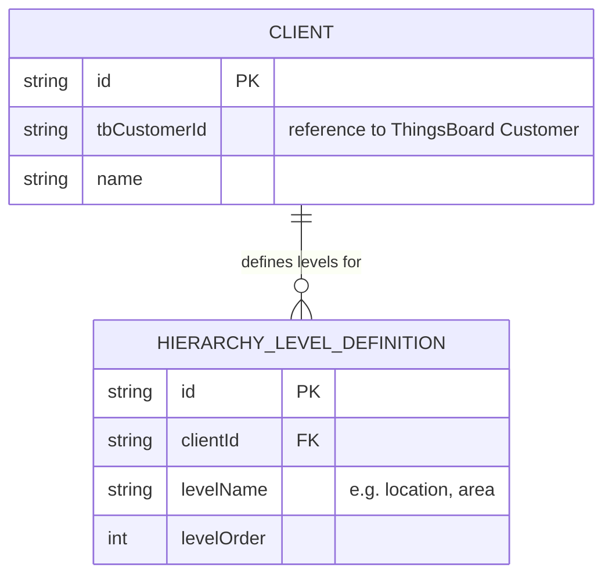

# Backend ERD — iot_app

## Current state: no own entities yet

`schema.prisma` was searched for across the whole repository and **it doesn't exist**. There's also no `prisma`/`@prisma/client` dependency in `backend/package.json`, and no `PrismaService` referenced anywhere in `backend/src`.

The entire data model today lives in ThingsBoard (Customers, Devices, Assets, Users, attributes, time series) and is consumed via `ThingsboardClientService` — there's no own PostgreSQL in production yet.

Therefore **a real ERD of own entities cannot be generated**, because none exist. What follows is the model *planned* for Phase 4 ("Client creation wizard & static hierarchy"), as described in `.paul/ROADMAP.md` / `.paul/STATE.md` — explicitly marked as pending, not implemented.

## Pending / planned — Phase 4 (not started)

Scope planned per STATE.md: a `hierarchy_level_definitions` table plus a `Client` reference, to model a static hierarchy (tenant/client/location/area) editable by the administrator — separate from the ThingsBoard customer-based scoping that already works today (see `backend-modules.md` and `backend-use-cases.md`). There's no final field design yet; this diagram is indicative, not a confirmed implementation.

Once `schema.prisma` is implemented, this document should be regenerated from the actual code.
