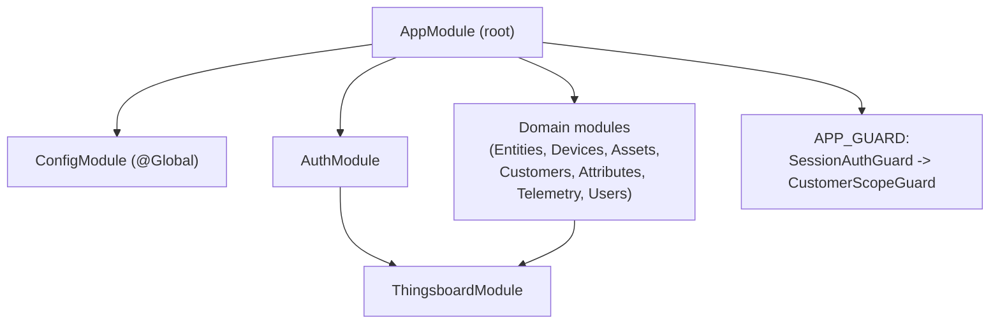
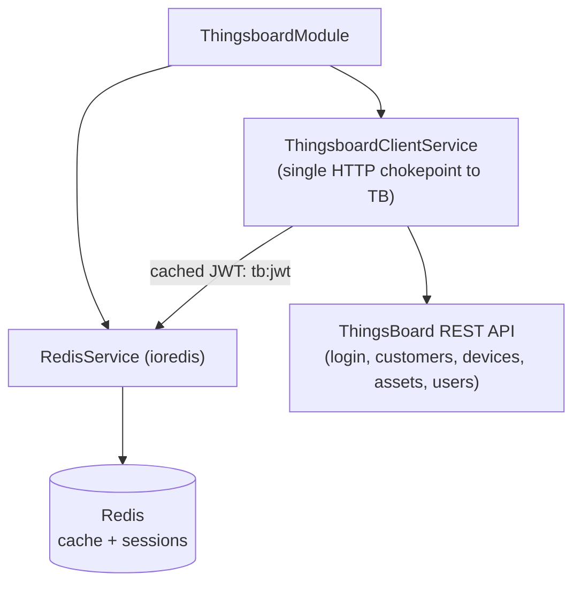
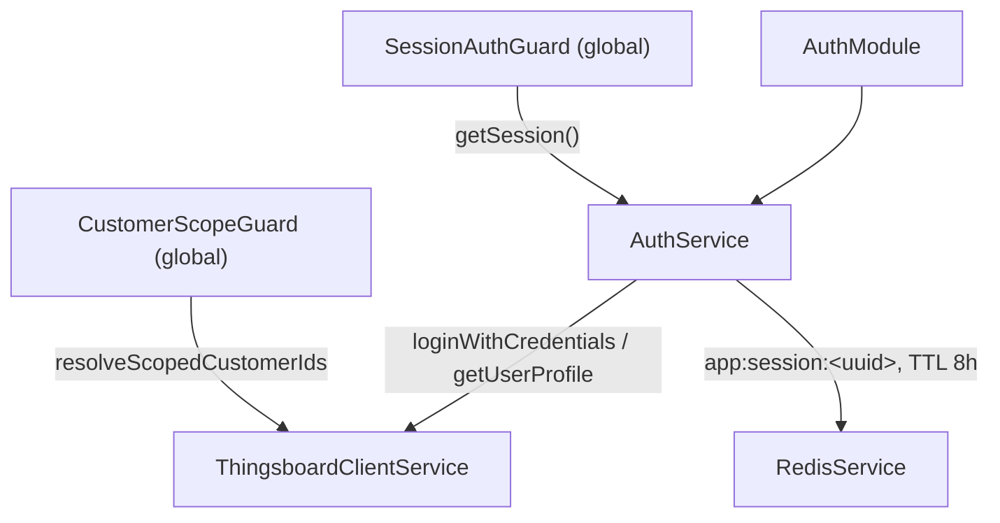
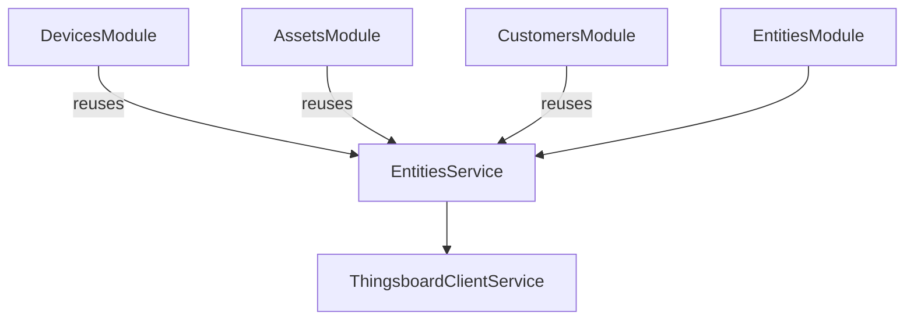
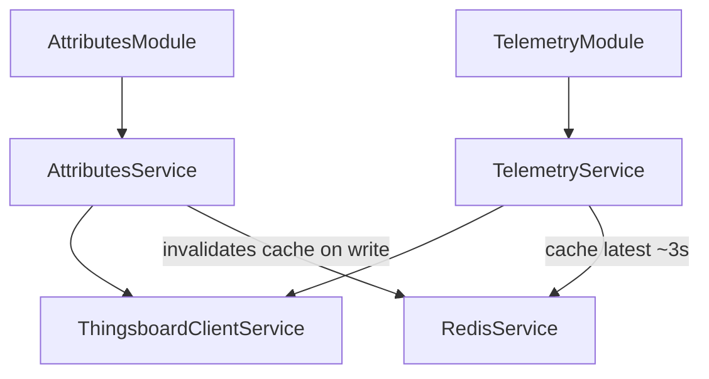
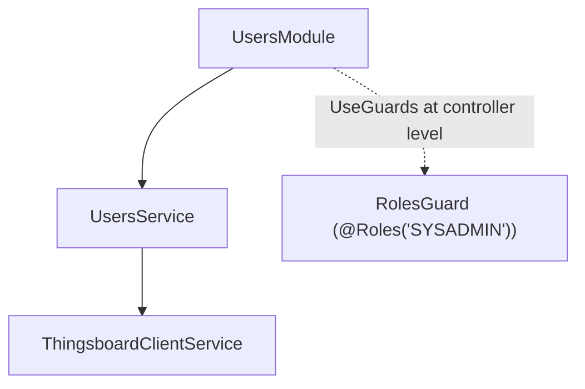

# Backend Modules — iot_app

Module diagram based on the actual NestJS `@Module()` decorators in the code (`backend/src/**/*.module.ts`), as of 2026-07-31 (end of Phase 2.2).

Stack: NestJS 10 + `@nestjs/platform-fastify`, `ioredis`, ThingsBoard as the data backend (no Prisma/PostgreSQL in the code yet).

## Overview — bootstrap and global guards

`SessionAuthGuard` is registered before `CustomerScopeGuard` in `AppModule` — the order matters (a real bug is documented in the code from when they were registered in separate modules).

## Domain: shared infrastructure (ThingsBoard + Redis)

Redis is used purely as a key/value cache (`get`/`set`/`del`/`delByPattern`) — no pub/sub, no queues (BullMQ) implemented.

## Domain: auth and sessions

Own session mechanism based on an opaque token (never exposed to the frontend as a JWT): ThingsBoard's real JWT never reaches the browser.

## Domain: entities (devices, assets, customers)

`DevicesModule`, `AssetsModule` and `CustomersModule` are thin wrappers with no providers of their own: they import `EntitiesModule` and reuse `EntitiesService`.

## Domain: telemetry and attributes

Time-series aggregation (`agg`, `interval`) is always delegated to ThingsBoard, never computed locally.

## Domain: users and roles

`RolesGuard` is only used today on `UsersController`; every other endpoint relies solely on the global guards.

## Pending / planned (not yet coded)

- **WebSockets** (Phase 3, "Not started"): `telemetry.gateway.ts` and `alarms.gateway.ts` don't exist; `@nestjs/websockets` is a declared dependency but unused.
- **Alarms module**: doesn't exist (`alarms/` hasn't been created).
- **Prisma/PostgreSQL** (Phase 4, "Not started"): no `schema.prisma`, no `@prisma/client`, no `PrismaService` in the repo.
- **Static tenant/client/location/area hierarchy** via `client_hierarchy_levels`: planned only, not implemented.
