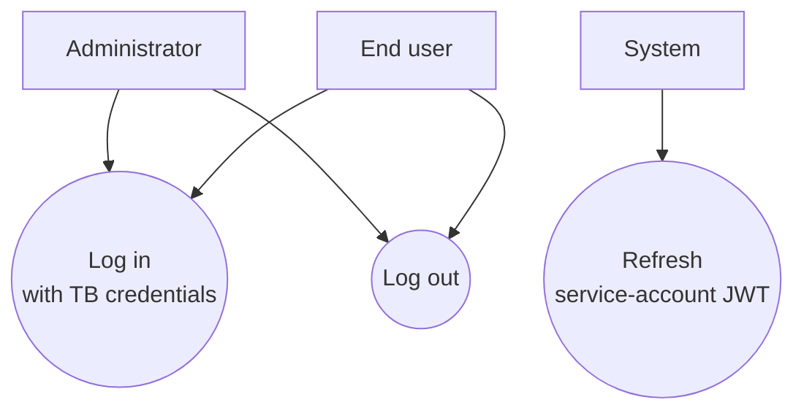
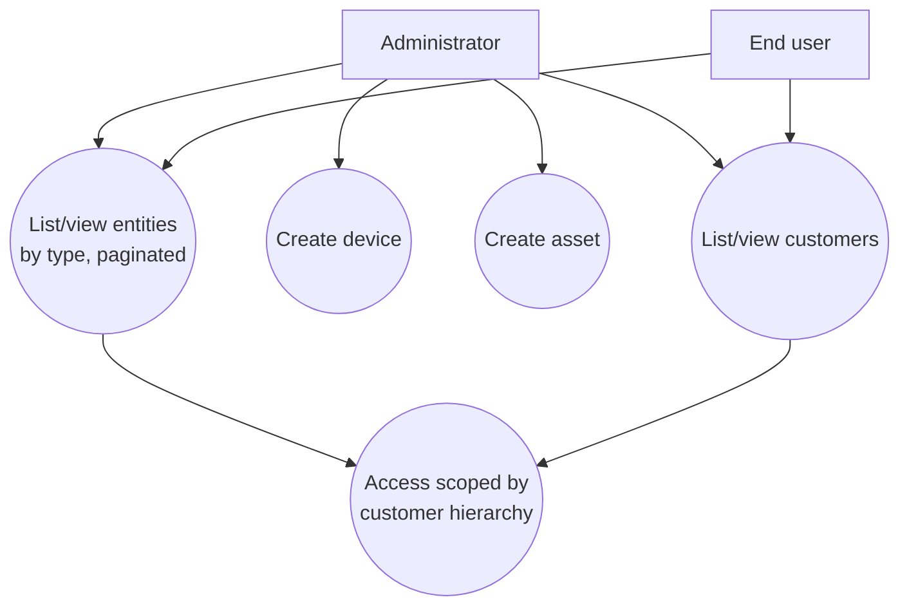
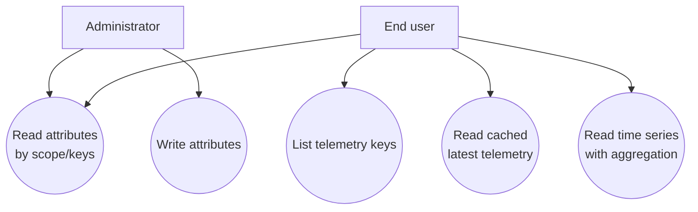
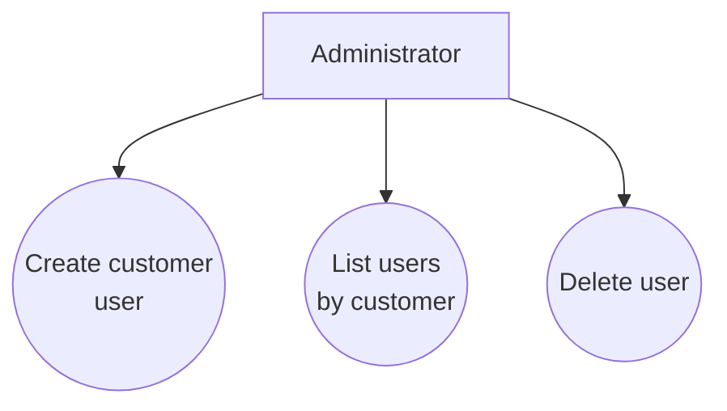

# Backend Use Cases — iot_app

Use cases based on the endpoints/services actually implemented in `backend/src` as of 2026-07-31 (end of Phase 2.2). Does not include dashboards, telemetry_definitions, or alarms because **they don't exist in the code** — see "Pending" section.

Actors:
- **Administrator**: session with `authority` `TENANT_ADMIN`/`SYS_ADMIN`, or `appRole` `ADMIN` over their customer.
- **End user**: `CUSTOMER_USER` with access scoped to their customer and descendants.
- **System**: automatic synchronization/authentication against ThingsBoard (service-account JWT caching, token refresh).

## Authentication and session

`UC1` validates against TB (`loginWithCredentials` + `getUserProfile`) and creates an own session in Redis (opaque token, 8h TTL); TB's JWT is never exposed to the frontend. `UC3` happens automatically when the cached JWT (`tb:jwt`) expires or TB responds with 401.

## Hierarchy management (customers, devices, assets)

`UC5` is cross-cutting: `CustomerScopeGuard` verifies that the target entity belongs to the user's own customer or a descendant (via TB's `parentCustomerId`), except for a `TENANT_ADMIN`/`SYS_ADMIN` bypass. There are no additional levels (location/area/sensor) — only ThingsBoard's native Customer hierarchy.

## Attributes and telemetry

`UC2` invalidates the attribute read cache. `UC4` uses a ~3s Redis cache; `UC5` always delegates aggregation (`agg`/`interval`) to ThingsBoard.

## Users and roles

The entire `UsersController` is protected by `@Roles('SYSADMIN')` (only `TENANT_ADMIN`/`SYS_ADMIN`). `UC3` explicitly blocks deleting the tenant admin account.

## Pending / planned (not yet coded)

- **Dashboards**: no controller/service or endpoints.
- **Telemetry definitions** (key catalog with metadata): doesn't exist, only dynamic reading of keys/values.
- **Alarms**: full module pending (Phase 3), including alarm ack/clear.
- **Real-time notifications** (telemetry/alarm WebSocket gateways): Phase 3, not started.
- **Granular area/asset-level permissions**: explicitly deferred to V2 in the roadmap; scoping today is Customer-level only.
- **Client creation wizard with static hierarchy** (tenant/client/location/area): Phase 4, not started.
